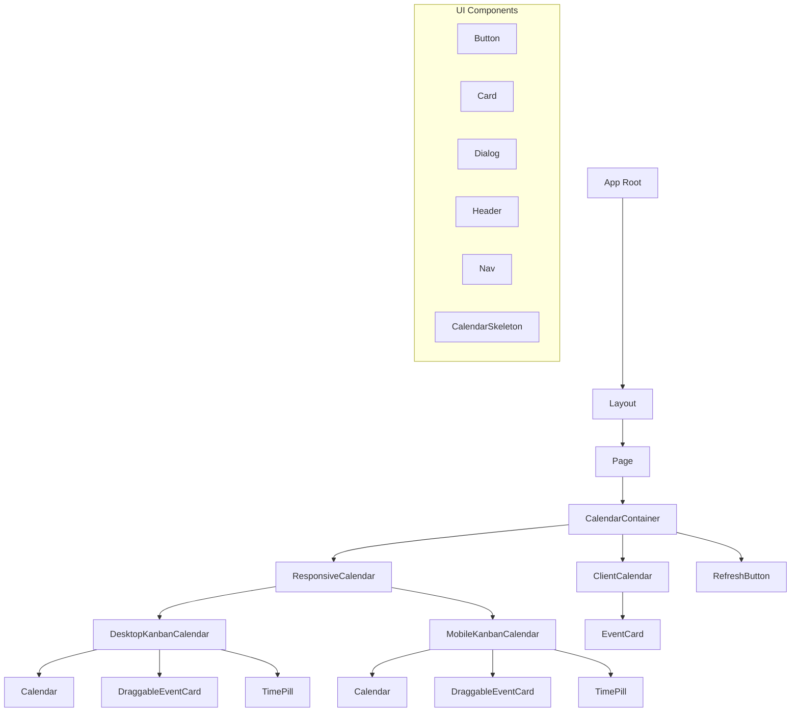
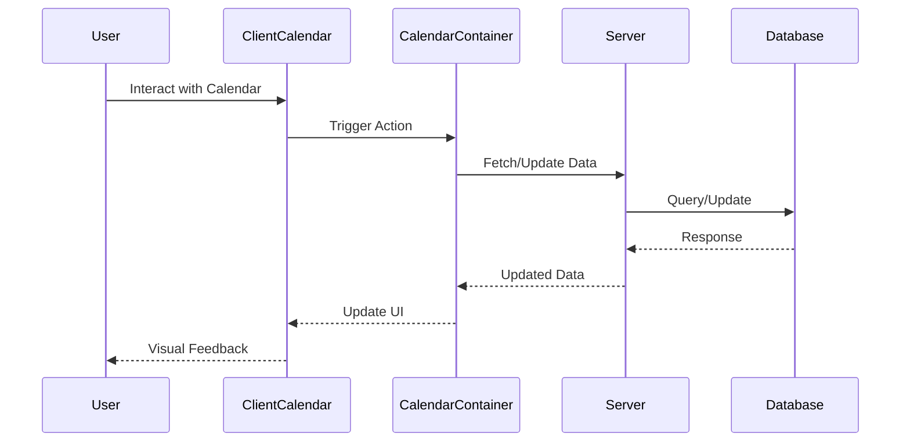
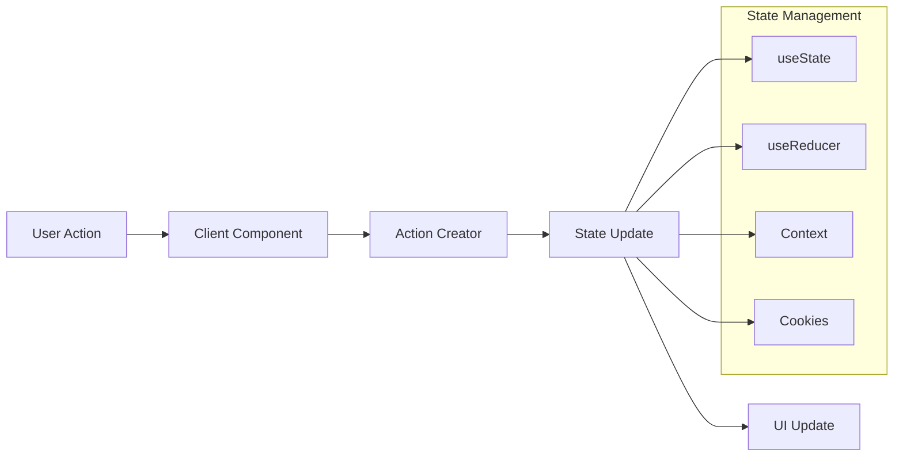
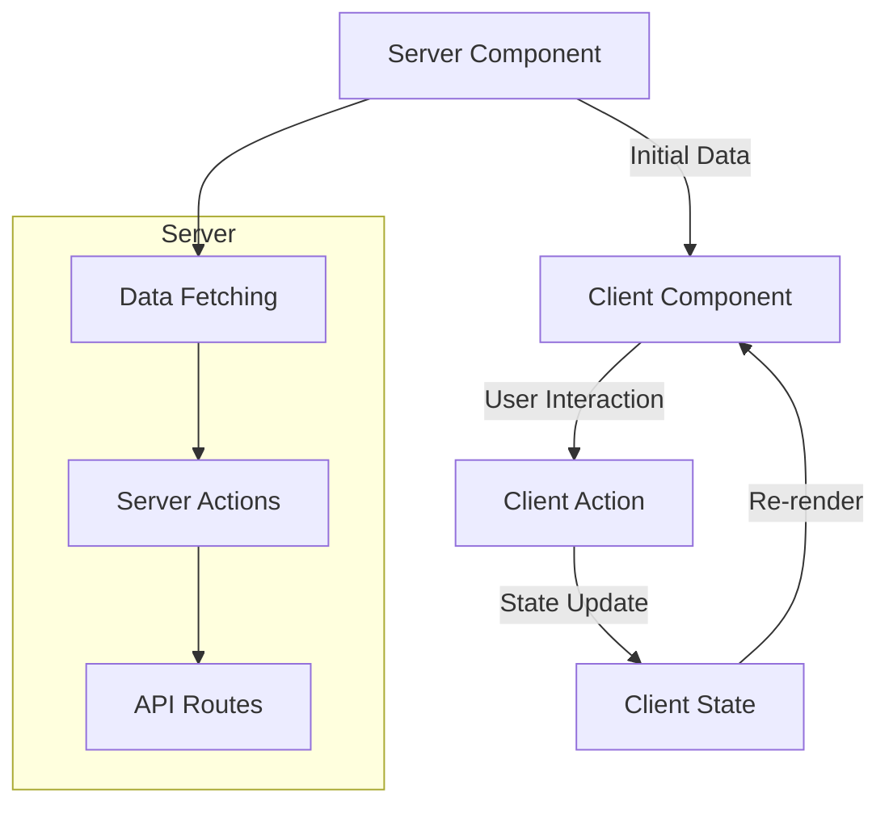
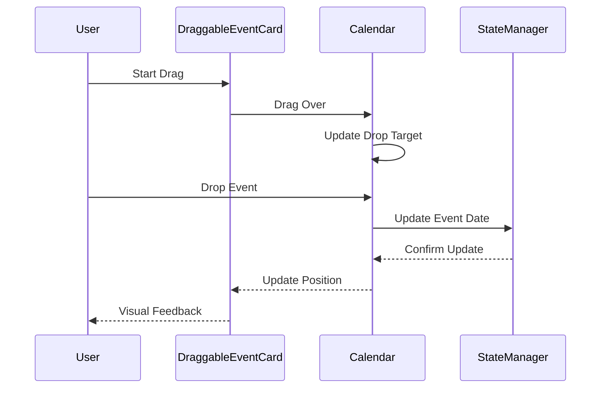
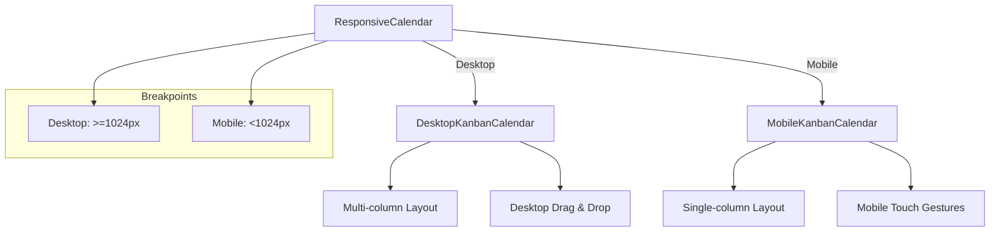
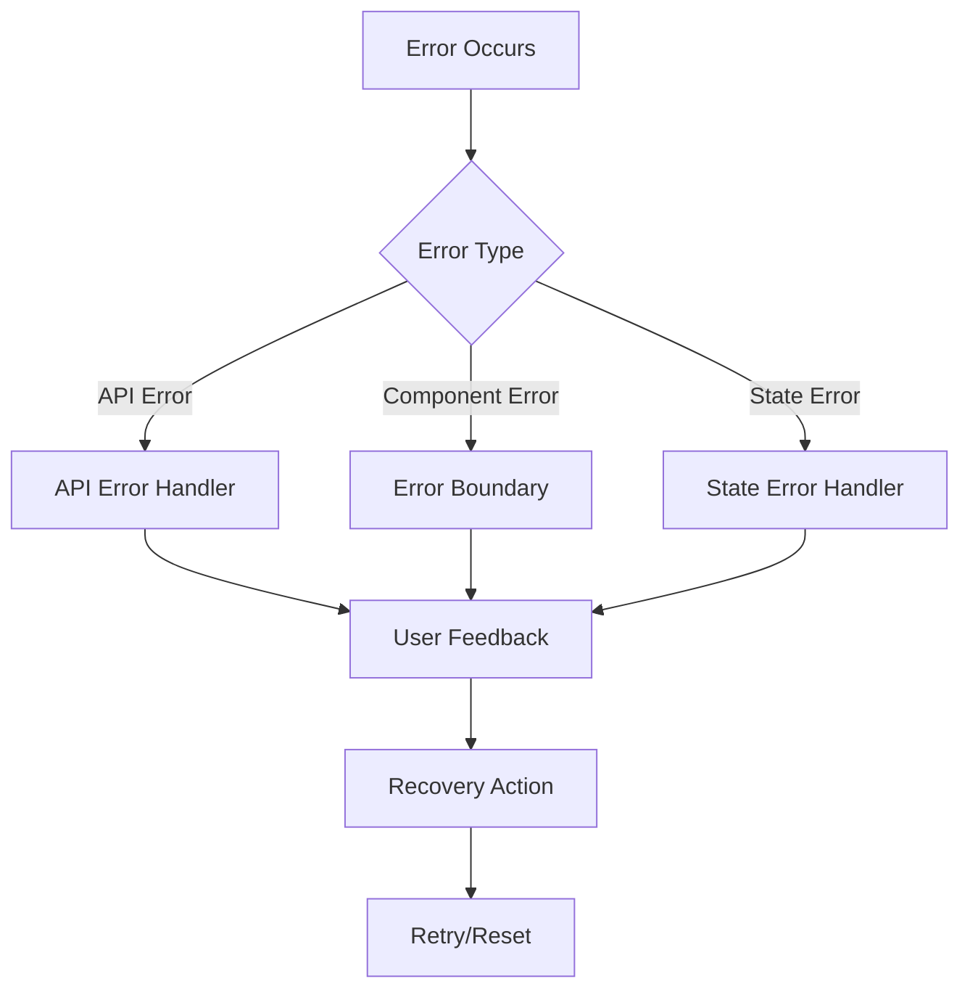
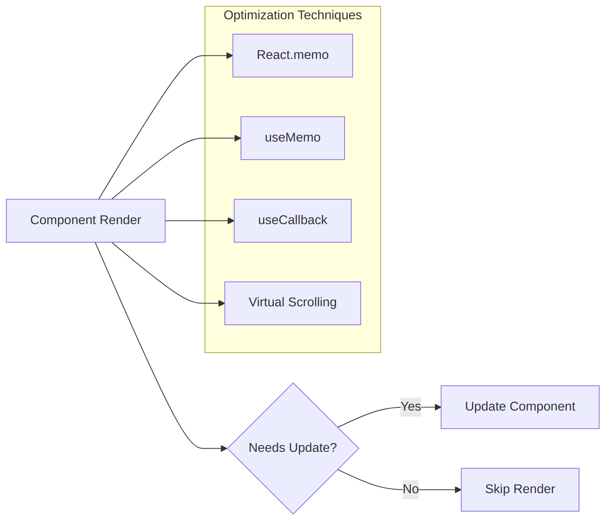
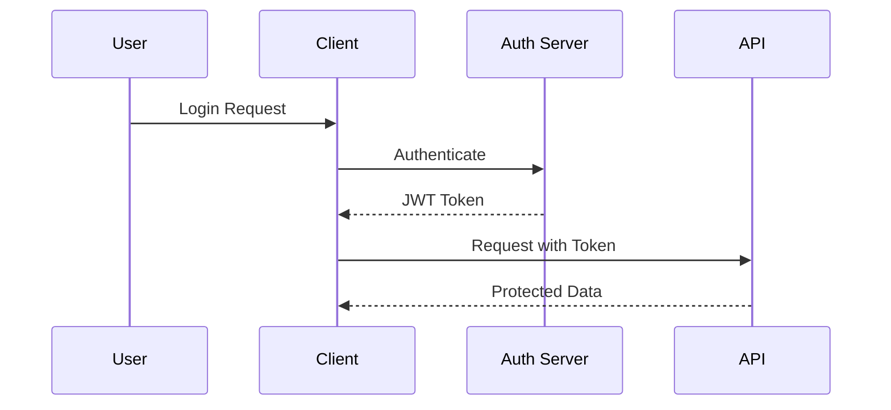
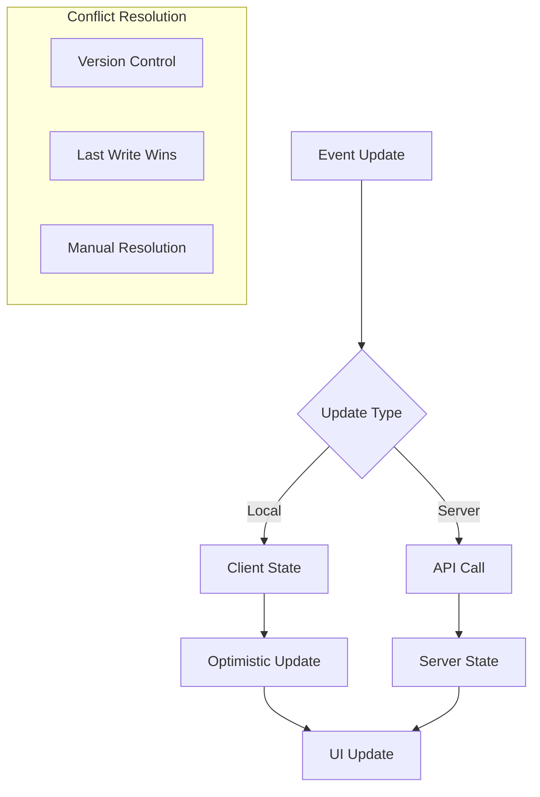

# Application Flow Diagrams

## Component Hierarchy

## Data Flow

## State Management Flow

## Server-Client Component Interaction

## Drag and Drop Flow

## Responsive Layout Flow

## Error Handling Flow

## Performance Optimization Flow

## Authentication Flow (Future Implementation)

## Event Synchronization Flow

These diagrams provide a comprehensive view of the application's architecture, data flow, and component interactions. They can be used for:
1. Understanding the system architecture
2. Debugging issues
3. Planning new features
4. Onboarding new developers
5. Documentation purposes

Each diagram focuses on a specific aspect of the application, making it easier to understand different parts of the system in isolation. 